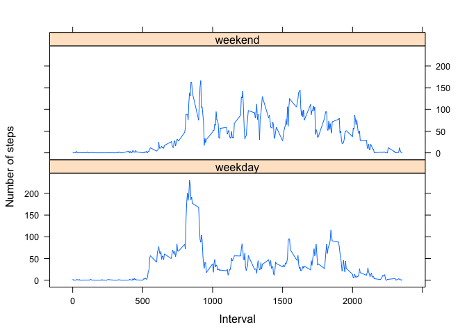

# Reproducible Research: Peer Assessment 1

## Loading and preprocessing the data

Let's begin by performing the prep work, such as loading data, performing data transformation, and loading libraries.


```r
# Set digits option
options(digits = 12)

# Unzip the zip file
unzip("activity.zip")

# Load the data
activity_data <- read.csv("activity.csv", header = TRUE, sep = ",")

# Check the data
summary(activity_data)
```

```
##      steps                     date          interval      
##  Min.   :  0.0000000   2012-10-01:  288   Min.   :   0.00  
##  1st Qu.:  0.0000000   2012-10-02:  288   1st Qu.: 588.75  
##  Median :  0.0000000   2012-10-03:  288   Median :1177.50  
##  Mean   : 37.3825996   2012-10-04:  288   Mean   :1177.50  
##  3rd Qu.: 12.0000000   2012-10-05:  288   3rd Qu.:1766.25  
##  Max.   :806.0000000   2012-10-06:  288   Max.   :2355.00  
##  NA's   :2304          (Other)   :15840
```

```r
str(activity_data)
```

```
## 'data.frame':	17568 obs. of  3 variables:
##  $ steps   : int  NA NA NA NA NA NA NA NA NA NA ...
##  $ date    : Factor w/ 61 levels "2012-10-01","2012-10-02",..: 1 1 1 1 1 1 1 1 1 1 ...
##  $ interval: int  0 5 10 15 20 25 30 35 40 45 ...
```

We can see that the date field is Factor, so we will convert it to a date type.


```r
# The date field is Factor, so we need to convert this to a date format
# Use as.Date() to convert to date format YYYY-MM-DD
activity_data$date <- as.Date(activity_data$date)
head(activity_data)
```

```
##   steps       date interval
## 1    NA 2012-10-01        0
## 2    NA 2012-10-01        5
## 3    NA 2012-10-01       10
## 4    NA 2012-10-01       15
## 5    NA 2012-10-01       20
## 6    NA 2012-10-01       25
```

Initially, we will work with complete cases and ignore missing values (NAs). Later, we will use the full dataset that includes the NAs.


```r
# Ignore missing values
complete_cases <- activity_data[complete.cases(activity_data), ]
head(complete_cases)
```

```
##     steps       date interval
## 289     0 2012-10-02        0
## 290     0 2012-10-02        5
## 291     0 2012-10-02       10
## 292     0 2012-10-02       15
## 293     0 2012-10-02       20
## 294     0 2012-10-02       25
```

```r
# We are ready for analysis, so load libraries
library(plyr)
library(lattice)
```

## What is mean total number of steps taken per day?

We will ignore missing values in the dataset and look at complete cases only.

First, let's calculate the total number of steps taken per day.


```r
# Calculate the total number of steps taken per day
plot1 <- ddply(complete_cases, .(date), summarize, total_steps = sum(steps))
head(plot1)
```

```
##         date total_steps
## 1 2012-10-02         126
## 2 2012-10-03       11352
## 3 2012-10-04       12116
## 4 2012-10-05       13294
## 5 2012-10-06       15420
## 6 2012-10-07       11015
```

Now, let's make a histogram of the total number of steps taken each day. We will use a breaks size of 35 to see the spread of the data.


```r
# Create a histogram of the total number of steps taken each day
hist(plot1$total_steps,
     breaks = 35,
     col = "red",
     main = paste("Histogram of daily steps"),
     xlab = "Steps")
```

 

Finally, let's calculate and report the mean and median of the total number of steps taken per day. The **summary()** function will give us what we need and we can extract the relevant fields.


```r
# Report the mean
summary(plot1$total_steps)["Mean"]
```

```
##       Mean 
## 10766.1887
```

```r
# Report the median
summary(plot1$total_steps)["Median"]
```

```
## Median 
##  10765
```

## What is the average daily activity pattern?

First, we need to calculate the average daily steps.


```r
# Calculate the mean steps per day
plot2 <- ddply(complete_cases, .(interval), summarize, average_steps = mean(steps))
head(plot2)
```

```
##   interval   average_steps
## 1        0 1.7169811320755
## 2        5 0.3396226415094
## 3       10 0.1320754716981
## 4       15 0.1509433962264
## 5       20 0.0754716981132
## 6       25 2.0943396226415
```

Now, we will make a time series plot (i.e. type = "l") of the 5-minute interval (x-axis) and the average number of steps taken, averaged across all days (y-axis).


```r
# Make a time series plot (i.e. type = "l") of the 5-minute interval (x-axis)
# and the average number of steps taken, averaged across all days (y-axis)
plot(plot2$interval,
     plot2$average_steps,
     type = "l",
     main = paste("Time series of average across all days"),
     xlab = "Interval",
     ylab = "Steps")
```

 

Finally, we will find the 5-minute interval, on average across all the days in the dataset, that contains the maximum number of steps. The **which.max()** function will give us the interval we need.


```r
# Which 5-minute interval, on average across all the days in the dataset,
# contains the maximum number of steps?
plot2[which.max(plot2$average_steps), ]
```

```
##     interval average_steps
## 104      835 206.169811321
```

The interval is 835.

## Imputing missing values

First, let's calculate and report the total number of missing values in the dataset (i.e. the total number of rows with NAs). The **summary()** function will give us what we need and we can extract the relevant field.


```r
# Report the total number of missing values in the dataset (i.e. the total number of rows with NAs)
summary(activity_data$steps)["NA's"]
```

```
## NA's 
## 2304
```

Now, we need to devise a strategy for filling in all of the missing values in the dataset. So, we will replace the NAs with interval averages, calculated in the previous section. We will also create a new dataset that is equal to the original dataset, but with the missing data filled-in.


```r
# Replace NAs with interval averages
# Create a new dataset that is equal to the original dataset but with the missing data filled-in
new_activity_data <- activity_data
new_activity_data$steps <- ifelse(is.na(new_activity_data$steps),
                                  plot2$average_steps[match(new_activity_data$interval, plot2$interval)],
                                  new_activity_data$steps)
```

Next, let's calculate the total number of steps taken per day.


```r
# Calculate the total number of steps taken per day
plot3 <- ddply(new_activity_data, .(date), summarize, total_steps = sum(steps))
head(plot3)
```

```
##         date   total_steps
## 1 2012-10-01 10766.1886792
## 2 2012-10-02   126.0000000
## 3 2012-10-03 11352.0000000
## 4 2012-10-04 12116.0000000
## 5 2012-10-05 13294.0000000
## 6 2012-10-06 15420.0000000
```

Next, we will make a histogram of the total number of steps taken each day. We will use a breaks size of 35 to see the spread of the data.


```r
# Create a histogram of the total number of steps taken each day
hist(plot3$total_steps,
     breaks = 35,
     col = "turquoise",
     main = paste("Histogram of daily steps"),
     xlab = "Steps")
```

 

Finally, we will calculate and report the mean and median total number of steps taken per day. The **summary()** function will give us what we need and we can extract the relevant fields. We notice that there is a small difference between the values reported here and those in the first part of the report and the median now equals the mean.


```r
# Report the mean
summary(plot3$total_steps)["Mean"]
```

```
##       Mean 
## 10766.1887
```

```r
# Report the median
summary(plot3$total_steps)["Median"]
```

```
##     Median 
## 10766.1887
```

## Are there differences in activity patterns between weekdays and weekends?

For this part of the report, we will use the **weekdays()** function. We will also use the dataset with the filled-in missing values.

First, we will create a new factor variable in the dataset with two levels – "weekday" and "weekend" indicating whether a given date is a weekday or weekend day.


```r
# Define weekday and weekend
weekday <- c("Monday", "Tuesday", "Wednesday", "Thursday", "Friday")
weekend <- c("Saturday", "Sunday")

# Create the factor variable
new_activity_data$day_of_week <- as.factor(ifelse(weekdays(new_activity_data$date) %in% weekday,
                                                  "weekday", "weekend"))
```

Next, we need to calculate the average daily steps.


```r
# Calculate the mean
plot4 <- ddply(new_activity_data, .(interval, day_of_week), summarize, average_steps = mean(steps))
head(plot4)
```

```
##   interval day_of_week   average_steps
## 1        0     weekday 2.2511530398323
## 2        0     weekend 0.2146226415094
## 3        5     weekday 0.4452830188679
## 4        5     weekend 0.0424528301887
## 5       10     weekday 0.1731656184486
## 6       10     weekend 0.0165094339623
```

Finally, we will make a panel plot containing a time series plot (i.e. type = "l") of the 5-minute interval (x-axis) and the average number of steps taken, averaged across all weekday days or weekend days (y-axis).


```r
# Make a panel plot containing a time series plot (i.e. type = "l") of the 5-minute interval (x-axis)
# and the average number of steps taken, averaged across all weekday days or weekend days (y-axis)
plot4 <- xyplot(average_steps ~ interval | day_of_week,
                data = plot4,
                type = "l",
                xlab = "Interval",
                ylab = "Number of steps",
                layout = c(1, 2))
print(plot4)
```

 
